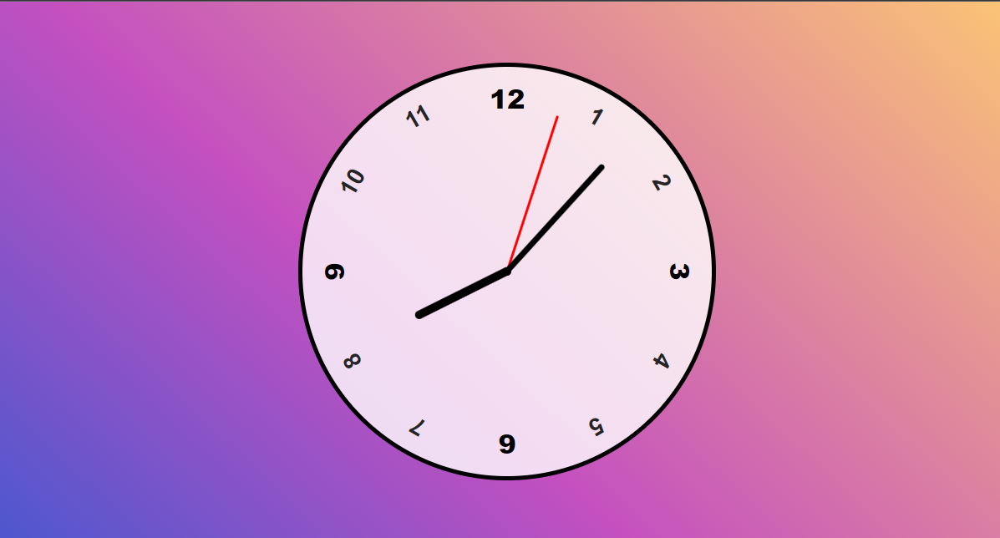

# Analogic Clock

>Essa aplicatição irá criar um relógio analógico local, conforme imagem abaixo.

## What you need

- HTML
- CSS
- JavaScript

## Set Up

To use or edit this code on your device:

1. Execute um `Editor de Código` --> Usei o VS Code;
2. Crie um diretório em sua **máquina** e baixe a aplicação `analog-clock`;
3. Fique a vontade para fazer qualquer tipo de _alteração_.

## How it works

O funcionamento é o básico de front-end. A aplicação foi criada com HTML, CSS e Javascript.

**_Seja criativo!!!_** 😃😃😃
